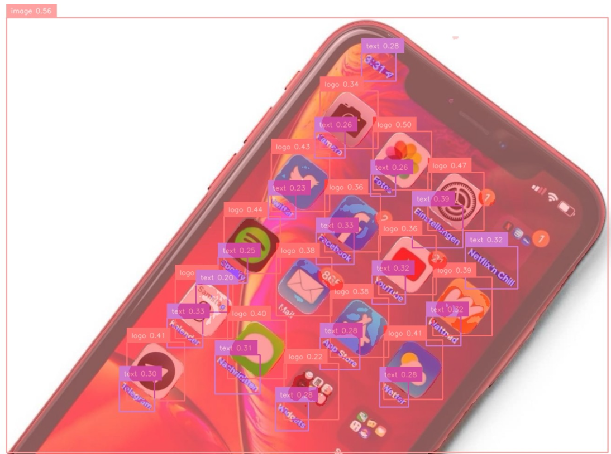

# 🚀 SeekVision: DINO-X Detection & Segmentation with DDS Cloud API

**SeekVision** is an interactive web app for object detection and segmentation using the latest **DDS Cloud API** and **DINO-X** models.  
Easily upload your images, choose prompt or prompt-free mode, and instantly visualize results with bounding boxes, segmentation masks, and class labels.

---

## 🖼️ Example Output

| Original | Annotated |
| :------: | :-------: |
|  |  |

---

## ⚙️ Installation & Setup

**1. Clone the Repository**
```bash
git clone https://github.com/MassiliaHe/SeekVision.git
cd SeekVision
````

**2. Install Dependencies**

```bash
uv pip install -r pyproject.toml
```

*Or use* `pip install -r requirements.txt` *if not using uv.*

**3. Set Up Environment Variables**
Create a `.env` file at the project root and add your DDS Cloud API key [create an account here](https://user.deepdataspace.com/login?redirect=https%3A%2F%2Fcloud.deepdataspace.com%2Fapply-token%3Ffrom%3Dsdk):

```env
API_KEY=your_dds_api_key_here
```

**4. Run the Application**

```bash
uv run streamlit run app.py
```

*Or use* `streamlit run app.py` *directly if you prefer.*

---

## 🚦 Usage Guide

1. **Enter your API key** (or load it from your `.env`).
2. **Choose** Prompt or Prompt-Free mode.
3. *(Optional)* **Set a text prompt** (e.g., `Text . logo . image`).
4. **Adjust** the bounding box threshold as needed.
5. **Upload an image** (`.jpg` or `.png`).
6. **Click "Run Inference"** to get annotated results and downloadable JSON.

---

## 📦 Output Formats

### Annotated Image

Bounding boxes, masks, and class labels are visualized directly on your image.

### JSON Output (COCO-Style)

```json
{
    "detections": [
        {
            "bbox": [x_min, y_min, width, height],
            "category_name": "logo",
            "category_id": 1,
            "score": 0.85
        }
    ]
}
```

---

## 🛠 Tech Stack

* **Streamlit** — Fast web interface
* **DDS Cloud API** — Cutting-edge object detection & segmentation
* **Supervision** — Visualization library
* **OpenCV, NumPy** — Image processing
* **pycocotools** — COCO mask decoding

---

## 📄 License

[MIT License](LICENSE)

---

## ⭐️ Support

If you find this project helpful, please consider giving it a ⭐️ on [GitHub](https://github.com/MassiliaHe/SeekVision)!
Feel free to open issues or contribute.
